# Pemrograman Mobile Pertemuan Minggu 6

| Nama  :   | Haidar Aly |
| :--------: | :-------: |

| Kelas :  | TI-3F    |
| :--------: | :-------: |

| Absen : |  09  |
| :--------: | :-------: |

| NIM   :  | 2241720258   |
| :--------: | :-------: |

## Praktikum 1

## Langkah 1 - Membuat project flutter baru
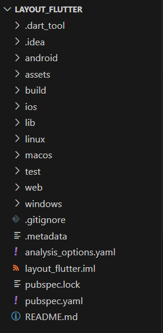

## Langkah 2 - Menambahkan kode berikut
```dart
import 'package:flutter/material.dart';

void main() => runApp(const MyApp());

class MyApp extends StatelessWidget {
  const MyApp({super.key});

  @override
  Widget build(BuildContext context) {
    return MaterialApp(
      title: 'Flutter layout: Nama dan NIM Anda',
      home: Scaffold(
        appBar: AppBar(
          title: const Text('Flutter layout demo'),
        ),
        body: const Center(
          child: Text('Hello World'),
        ),
      ),
    );
  }
}
```

## Langkah 3 - Implementasi title row
```dart
Widget titleSection = Container(
  padding: const EdgeInsets.all(...),
  child: Row(
    children: [
      Expanded(
        /* soal 1*/
        child: Column(
          crossAxisAlignment: ...,
          children: [
            /* soal 2*/
            Container(
              padding: const EdgeInsets.only(bottom: ...),
              child: const Text(
                'Wisata Gunung di Batu',
                style: TextStyle(
                  fontWeight: FontWeight.bold,
                ),
              ),
            ),
            Text(
              'Batu, Malang, Indonesia',
              style: TextStyle(...),
            ),
          ],
        ),
      ),
      /* soal 3*/
      Icon(
       ...,
        color: ...,
      ),
      const Text(...),
    ],
  ),
);
```

### Soal 1
```dart
child: Column(
    crossAxisAlignment: CrossAxisAlignment.start,
    children: [
```

### Soal 2
```dart
Container(
    padding: const EdgeInsets.only(bottom: 8),
    child: const Text(
        'Wisata Gunung di Batu',
        style: TextStyle(
            fontWeight: FontWeight.bold,
        ),
    ),
),
Text(
    'Batu, Malang, Indonesia',
    style: TextStyle(
        color: Colors.grey[500],
    ),
),
```

### Soal 3
```dart
padding: const EdgeInsets.all(32),
...
// kode sebelumnya
...
Icon(
    Icons.star,
    color: Colors.red[500],
),
const Text('41'),
...
// kode lain
...
body: Column(
    children: [
        titleSection,
    ],
)
```

### Hasil
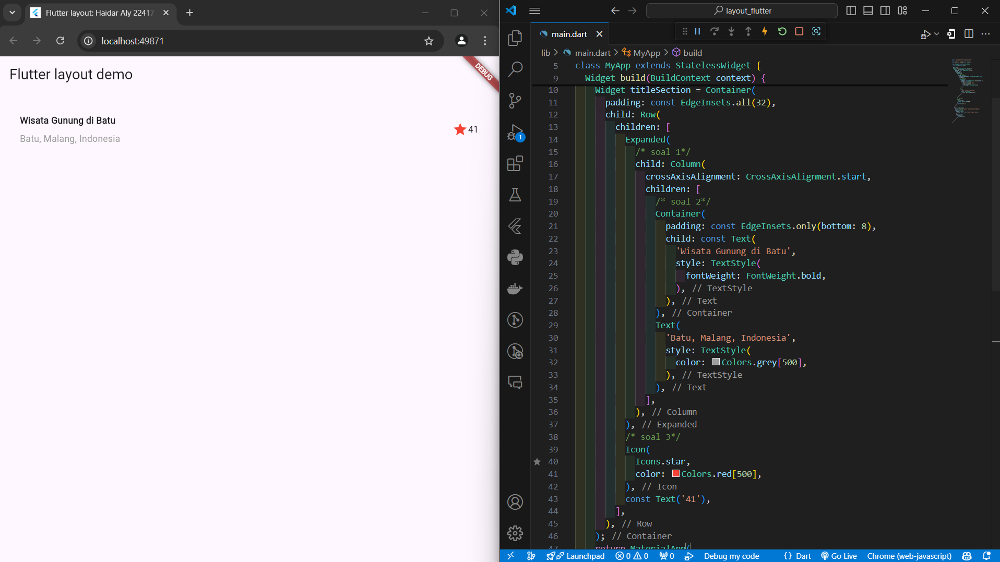

## Praktikum 2

### Langkah 1 - Menambahkan kode berikut
```dart
class MyApp extends StatelessWidget {
  const MyApp({super.key});

  @override
  Widget build(BuildContext context) {
    // ···
  }

  Column _buildButtonColumn(Color color, IconData icon, String label) {
    return Column(
      mainAxisSize: MainAxisSize.min,
      mainAxisAlignment: MainAxisAlignment.center,
      children: [
        Icon(icon, color: color),
        Container(
          margin: const EdgeInsets.only(top: 8),
          child: Text(
            label,
            style: TextStyle(
              fontSize: 12,
              fontWeight: FontWeight.w400,
              color: color,
            ),
          ),
        ),
      ],
    );
  }
}
```

### Langkah 2 - Membuat widget buttonsection
```dart
Color color = Theme.of(context).primaryColor;

Widget buttonSection = Row(
  mainAxisAlignment: MainAxisAlignment.spaceEvenly,
  children: [
    _buildButtonColumn(color, Icons.call, 'CALL'),
    _buildButtonColumn(color, Icons.near_me, 'ROUTE'),
    _buildButtonColumn(color, Icons.share, 'SHARE'),
  ],
);
```

### Langkah 3 - Menambahkan buttonsection ke body
```dart
body: Column(
    children: [
        titleSection,
        buttonSection,
    ],
)
```

### Hasil
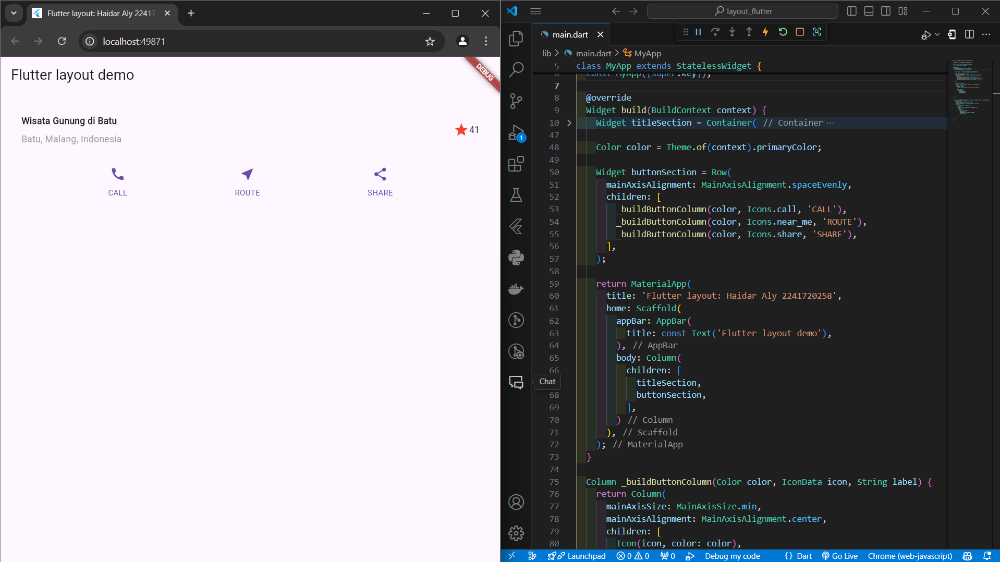

## Praktikum 3

### Langkah 1 - Membuat widget textsection
```dart
Widget textSection = Container(
  padding: const EdgeInsets.all(32),
  child: const Text(
    'Carilah teks di internet yang sesuai '
    'dengan foto atau tempat wisata yang ingin '
    'Anda tampilkan. '
    'Tambahkan nama dan NIM Anda sebagai '
    'identitas hasil pekerjaan Anda. '
    'Selamat mengerjakan 🙂.',
    softWrap: true,
  ),
);
```

### Langkah 2 - Tambahkan Variabel text ke body
```dart
body: Column(
    children: [
        titleSection,
        buttonSection,
        textSection,
    ],
)
```

### Hasil
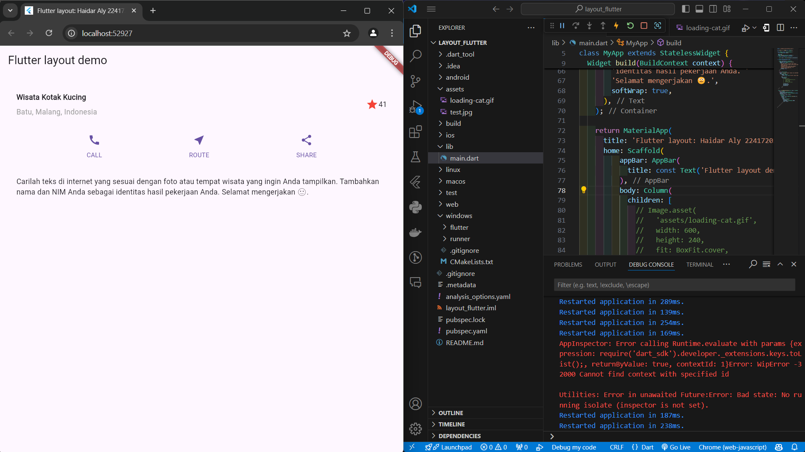

## Praktikum 4

### Langkah 1 - Tambah gambar ke dalam pubsec.yaml
```yaml
flutter:
  assets:
    - images/loading-cat.gif
```

### Langkah 2 - Menambahkan gambar ke dalam body
```dart
body: Column(
    children: [
        Image.asset(
            'images/loading-cat.gif',
            width: 600,
            height: 240,
            fit: BoxFit.cover,
        ),
        titleSection,
        buttonSection,
    ],
)
```

### Langkah 3 - Ubah column pada body menjadi listview
```dart
body: ListView(
    children: [
        Image.asset(
            'images/loading-cat.gif',
            width: 600,
            height: 240,
            fit: BoxFit.cover,
        ),
        titleSection,
        buttonSection,
        textSection,
    ],
)
```

### Hasil
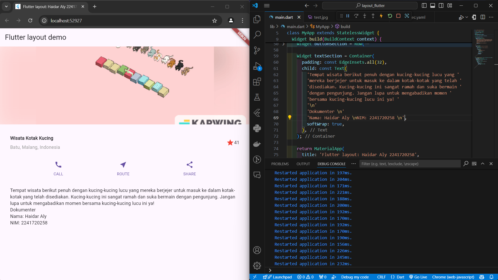

## Praktikum 5

### Langkah 1 - Siapkan project baru
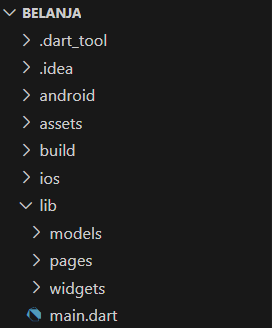

### Langkah 2 - Mendefinisikan Route
#### home_page.dart
```dart
import 'package:flutter/material.dart';

class HomePage extends StatelessWidget {
  @override
  Widget build(BuildContext context) {
    throw UnimplementedError();
  }
}
```
#### item_page.dart
```dart
import 'package:flutter/material.dart';

class ItemPage extends StatelessWidget {
  @override
  Widget build(BuildContext context) {
    throw UnimplementedError();
  }
}
```

### Langkah 3 - Lengkapi Kode di main.dart
```dart
import 'package:belanja/pages/home_page.dart';
import 'package:belanja/pages/item_page.dart';
import 'package:flutter/material.dart';

void main() {
  runApp(MaterialApp(
    initialRoute: '/',
    routes: {
      '/': (context) => HomePage(),
      '/item': (context) => const ItemPage(),
    },
  ));
}
```

### Langkah 4 - Membuat data model (item.dart)
```dart
class Item {
  String name;
  int price;

  Item({required this.name, required this.price});
}
```

### Langkah 5 - Lengkapi kode di class HomePage
```dart
import 'package:flutter/material.dart';

class HomePage extends StatelessWidget {
  final List<Item> items = [
      Item(name: 'Sugar', price: 5000),
      Item(name: 'Salt', price: 3000),
      Item(name: 'Rice', price: 10000),
    ];

  @override
  Widget build(BuildContext context) {
    throw UnimplementedError();
  }
}
```

### Langkah 6 - Membuat ListView dan itemBuilder
```dart
class HomePage extends StatelessWidget {
  final List<Item> items = [
    Item(name: 'Sugar', price: 5000),
    Item(name: 'Salt', price: 3000),
    Item(name: 'Rice', price: 10000),
  ];

  HomePage({super.key});
  @override
  Widget build(BuildContext context) {
    return Scaffold(
      appBar: AppBar(
        title: const Text("Belanja"),
      ),
      body: Container(
        margin: const EdgeInsets.all(8),
        child: ListView.builder(
          padding: const EdgeInsets.all(8),
          itemCount: items.length,
          itemBuilder: (context, index) {
            final item = items[index];
              child: Card(
                child: Container(
                  margin: const EdgeInsets.all(8),
                  child: Row(
                    children: [
                      Expanded(child: Text(item.name)),
                      Expanded(
                        child : Text(
                          item.price.toString(),
                          textAlign: TextAlign.end,
                        )
                      )
                    ],
                  ),
                )
              ),
          },
        ),
      ),
    );
  }
}
```

### Langkah 7 - Menambahkan aksi pada ListView
```dart
class HomePage extends StatelessWidget {
  final List<Item> items = [
    Item(name: 'Sugar', price: 5000),
    Item(name: 'Salt', price: 3000),
    Item(name: 'Rice', price: 10000),
  ];

  HomePage({super.key});
  @override
  Widget build(BuildContext context) {
    return Scaffold(
      appBar: AppBar(
        title: const Text("Belanja"),
      ),
      body: Container(
        margin: const EdgeInsets.all(8),
        child: ListView.builder(
          padding: const EdgeInsets.all(8),
          itemCount: items.length,
          itemBuilder: (context, index) {
            final item = items[index];
            return InkWell(
              onTap: () {
                Navigator.pushNamed(context, '/item', arguments: item);
              },
              child: Card(
                child: Container(
                  margin: const EdgeInsets.all(8),
                  child: Row(
                    children: [
                      Expanded(child: Text(item.name)),
                      Expanded(
                        child : Text(
                          item.price.toString(),
                          textAlign: TextAlign.end,
                        )
                      )
                    ],
                  ),
                )
              ),
            );
          },
        ),
      ),
    );
  }
  
}
```
### Hasil
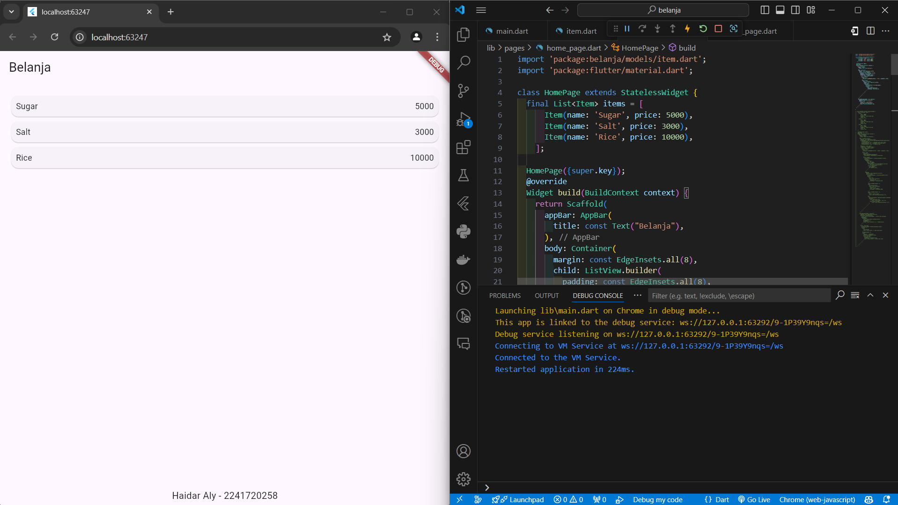
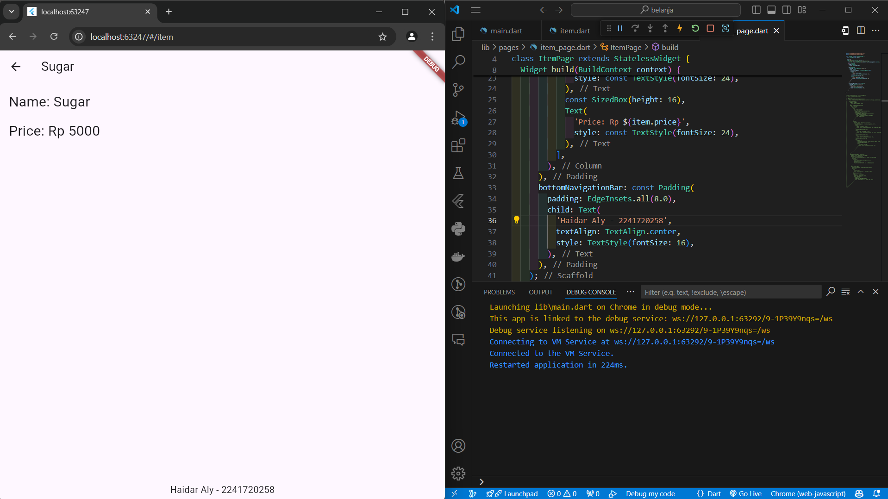

## Tugas 1
### Syntax (main.dart)
```dart
import 'package:flutter/material.dart';

void main() {
  runApp(MaterialApp(
    home: MyApp(),
  ));
}

class MyApp extends StatelessWidget {
  const MyApp({super.key});

  @override
  Widget build(BuildContext context) {
    const String appTitle = 'Flutter Layout - Banana Info';
    return MaterialApp(
      title: appTitle,
      home: Scaffold(
        appBar: AppBar(
          title: Text('Tugas 1 | Haidar Aly // 2241720258'),
          backgroundColor: Colors.orange,
        ),
        body: Padding(
          padding: const EdgeInsets.all(16.0),
          child: Row(
            crossAxisAlignment: CrossAxisAlignment.start,
            children: [
              // Left Column: All Text Content
              Expanded(
                flex: 1, // 1/3 of the screen for the text
                child: Column(
                  crossAxisAlignment: CrossAxisAlignment.center,
                  children: [
                    // Title Section
                    const Text(
                      'Banana Smoothie',
                      textAlign: TextAlign.center,
                      style: TextStyle(
                        fontSize: 28.0,
                        fontWeight: FontWeight.bold,
                        color: Colors.brown,
                      ),
                    ),
                    const SizedBox(height: 8.0),

                    // Description Section
                    const Text(
                      'A banana smoothie is a refreshing and creamy drink made by blending ripe bananas with milk, yogurt, or other ingredients. '
                      'It is packed with nutrients like potassium, vitamin C, and fiber, making it a delicious and healthy choice for breakfast or a snack.',
                      textAlign: TextAlign.center,
                      style: TextStyle(fontSize: 16.0, color: Colors.black87),
                    ),
                    const SizedBox(height: 16.0),

                    // Ratings Section
                    Row(
                      mainAxisAlignment: MainAxisAlignment.center,
                      children: [
                        Icon(Icons.star, color: Colors.yellow[600]),
                        Icon(Icons.star, color: Colors.yellow[600]),
                        Icon(Icons.star, color: Colors.yellow[600]),
                        Icon(Icons.star, color: Colors.yellow[600]),
                        Icon(Icons.star_half, color: Colors.yellow[600]),
                        SizedBox(width: 8.0),
                        const Text('232 Reviews', style: TextStyle(fontSize: 16.0)),
                      ],
                    ),
                    const SizedBox(height: 16.0),

                    // Info Section (Prep Time, Cook Time, Feeds)
                    Row(
                      mainAxisAlignment: MainAxisAlignment.spaceEvenly,
                      children: const [
                        InfoTile(icon: Icons.kitchen, label: 'PREP:', value: '10 min'),
                        InfoTile(icon: Icons.timer, label: 'COOK:', value: '0 min'),
                        InfoTile(icon: Icons.restaurant, label: 'SERVES:', value: '2-3'),
                      ],
                    ),
                    const SizedBox(height: 16.0),
                  ],
                ),
              ),

              // Right Column: Image
              Expanded(
                flex: 2, // 2/3 of the screen for the image
                child: ClipRRect(
                  borderRadius: BorderRadius.circular(20.0),
                  child: Image.asset(
                    'images/banana.jpg',
                    height: double.infinity,
                    fit: BoxFit.cover,
                  ),
                ),
              ),
            ],
          ),
        ),
      ),
    );
  }
}

// InfoTile Widget to display each info section (Prep, Cook, Serves)
class InfoTile extends StatelessWidget {
  final IconData icon;
  final String label;
  final String value;

  const InfoTile({super.key, required this.icon, required this.label, required this.value});

  @override
  Widget build(BuildContext context) {
    return Column(
      children: [
        Icon(icon, color: Colors.orange),
        SizedBox(height: 4.0),
        Text(
          label,
          style: TextStyle(fontWeight: FontWeight.bold, color: Colors.brown),
        ),
        Text(value, style: TextStyle(color: Colors.black54)),
      ],
    );
  }
}
```
### Hasil
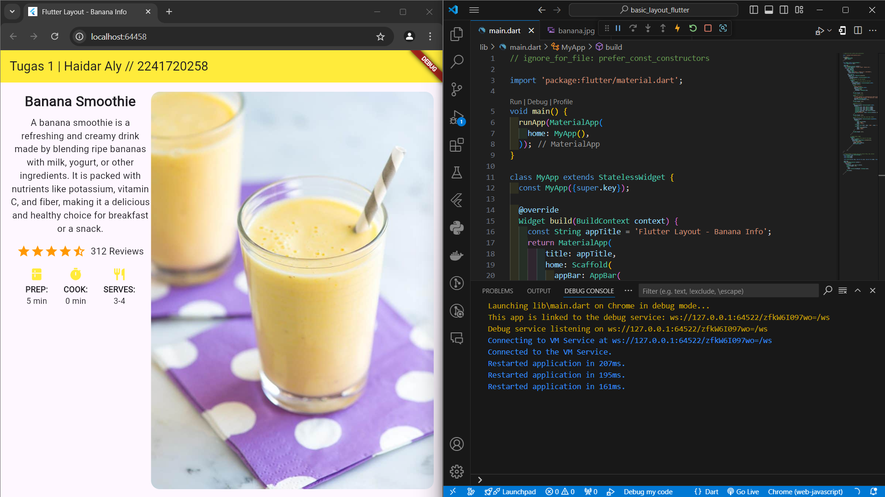

## Tugas 2
### Syntax (home_page.dart & item_page.dart)
```dart
import 'package:belanja/models/item.dart';
import 'package:flutter/material.dart';

class HomePage extends StatelessWidget {
  final List<Item> items = [
    Item(
        name: 'Sugar',
        price: 5000,
        imageUrl: 'assets/sugar.jpg',
        stock: 20,
        rating: 4.5),
    Item(
        name: 'Salt',
        price: 3000,
        imageUrl: 'assets/salt.jpg',
        stock: 15,
        rating: 4.0),
    Item(
        name: 'Rice',
        price: 10000,
        imageUrl: 'assets/rice.jpg',
        stock: 50,
        rating: 4.8),
  ];

  HomePage({super.key});
  @override
  Widget build(BuildContext context) {
    return Scaffold(
      appBar: AppBar(
        title: const Text("Belanja"),
      ),
      body: GridView.builder(
        padding: const EdgeInsets.all(8),
        gridDelegate: const SliverGridDelegateWithFixedCrossAxisCount(
          crossAxisCount: 2,
          crossAxisSpacing: 8.0, // Menambah jarak antar kolom
          mainAxisSpacing: 8.0, // Menambah jarak antar baris
          childAspectRatio: 0.75, // Proporsi item
        ),
        itemCount: items.length,
        itemBuilder: (context, index) {
          final item = items[index];
          return InkWell(
            onTap: () {
              Navigator.pushNamed(context, '/item', arguments: item);
            },
            child: Card(
              elevation: 4,
              shape: RoundedRectangleBorder(
                borderRadius: BorderRadius.circular(10),
              ),
              child: Column(
                crossAxisAlignment: CrossAxisAlignment.stretch,
                children: [
                  Expanded(
                    child: Hero(
                      tag: item.name,
                      child: ClipRRect(
                        borderRadius: const BorderRadius.vertical(
                            top: Radius.circular(10)),
                        child: Image.asset(
                          item.imageUrl,
                          fit: BoxFit.cover,
                        ),
                      ),
                    ),
                  ),
                  Padding(
                    padding: const EdgeInsets.all(8.0),
                    child: Column(
                      crossAxisAlignment: CrossAxisAlignment.start,
                      children: [
                        Text(
                          item.name,
                          style: const TextStyle(
                            fontSize: 18,
                            fontWeight: FontWeight.bold,
                          ),
                        ),
                        const SizedBox(height: 4),
                        Text(
                          'Rp ${item.price}',
                          style: const TextStyle(
                            fontSize: 16,
                            color: Colors.green,
                            fontWeight: FontWeight.w500,
                          ),
                        ),
                        const SizedBox(height: 4),
                        Text(
                          'Stock: ${item.stock}',
                          style: const TextStyle(fontSize: 14),
                        ),
                        Row(
                          mainAxisAlignment: MainAxisAlignment.spaceBetween,
                          children: [
                            const Icon(Icons.star,
                                color: Colors.amber, size: 16),
                            Text('${item.rating}',
                                style: const TextStyle(fontSize: 14)),
                          ],
                        ),
                      ],
                    ),
                  ),
                ],
              ),
            ),
          );
        },
      ),
      bottomNavigationBar: Container(
        padding: const EdgeInsets.all(16.0),
        decoration: BoxDecoration(
          color: Colors.blueGrey[800], // Warna latar belakang
          boxShadow: [
            BoxShadow(
              color: Colors.black.withOpacity(0.2),
              spreadRadius: 5,
              blurRadius: 7,
              offset: const Offset(0, 3), // Shadow posisi
            ),
          ],
        ),
        child: const Row(
          mainAxisAlignment: MainAxisAlignment.center,
          children: [
            Icon(
              Icons.person,
              color: Colors.white, // Ikon warna putih
            ),
            SizedBox(width: 8),
            Text(
              'Haidar Aly - 2241720258',
              textAlign: TextAlign.center,
              style: TextStyle(
                fontSize: 16,
                fontWeight: FontWeight.bold,
                color: Colors.white, // Warna teks putih
              ),
            ),
          ],
        ),
      ),
    );
  }
}
```

```dart
import 'package:belanja/models/item.dart';
import 'package:flutter/material.dart';

class ItemPage extends StatelessWidget {
  const ItemPage({super.key});

  @override
  Widget build(BuildContext context) {
    final Item itemArgs = ModalRoute.of(context)!.settings.arguments as Item;

    return Scaffold(
      appBar: AppBar(
        title: Text(itemArgs.name),
      ),
      body: SingleChildScrollView(
        child: Column(
          children: [
            Hero(
              tag: itemArgs.name,
              child: Container(
                margin: const EdgeInsets.all(16),
                height: 300,
                decoration: BoxDecoration(
                  borderRadius: BorderRadius.circular(16),
                  image: DecorationImage(
                    image: AssetImage(itemArgs.imageUrl),
                    fit: BoxFit.cover,
                  ),
                ),
              ),
            ),
            Padding(
              padding: const EdgeInsets.all(16.0),
              child: Column(
                crossAxisAlignment: CrossAxisAlignment.start,
                children: [
                  Text(
                    'Name: ${itemArgs.name}',
                    style: const TextStyle(fontSize: 24, fontWeight: FontWeight.bold),
                  ),
                  const SizedBox(height: 16),
                  Text(
                    'Price: Rp ${itemArgs.price}',
                    style: const TextStyle(fontSize: 24, color: Colors.green),
                  ),
                  const SizedBox(height: 8),
                  Text(
                    'Stock: ${itemArgs.stock}',
                    style: const TextStyle(fontSize: 18),
                  ),
                  const SizedBox(height: 8),
                  Row(
                    children: [
                      const Icon(Icons.star, color: Colors.amber, size: 20),
                      const SizedBox(width: 4),
                      Text(
                        '${itemArgs.rating}',
                        style: const TextStyle(fontSize: 18),
                      ),
                    ],
                  ),
                ],
              ),
            ),
          ],
        ),
      ),
      bottomNavigationBar: Container(
        padding: const EdgeInsets.all(16.0),
        decoration: BoxDecoration(
          color: Colors.blueGrey[800], // Warna latar belakang
          boxShadow: [
            BoxShadow(
              color: Colors.black.withOpacity(0.2),
              spreadRadius: 5,
              blurRadius: 7,
              offset: const Offset(0, 3), // Shadow posisi
            ),
          ],
        ),
        child: const Row(
          mainAxisAlignment: MainAxisAlignment.center,
          children: [
            Icon(
              Icons.person,
              color: Colors.white, // Ikon warna putih
            ),
            SizedBox(width: 8),
            Text(
              'Haidar Aly - 2241720258',
              textAlign: TextAlign.center,
              style: TextStyle(
                fontSize: 16,
                fontWeight: FontWeight.bold,
                color: Colors.white, // Warna teks putih
              ),
            ),
          ],
        ),
      ),
    );
  }
}
```

### Hasil (Homepage & Itempage)
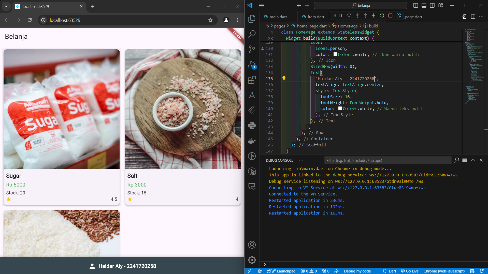
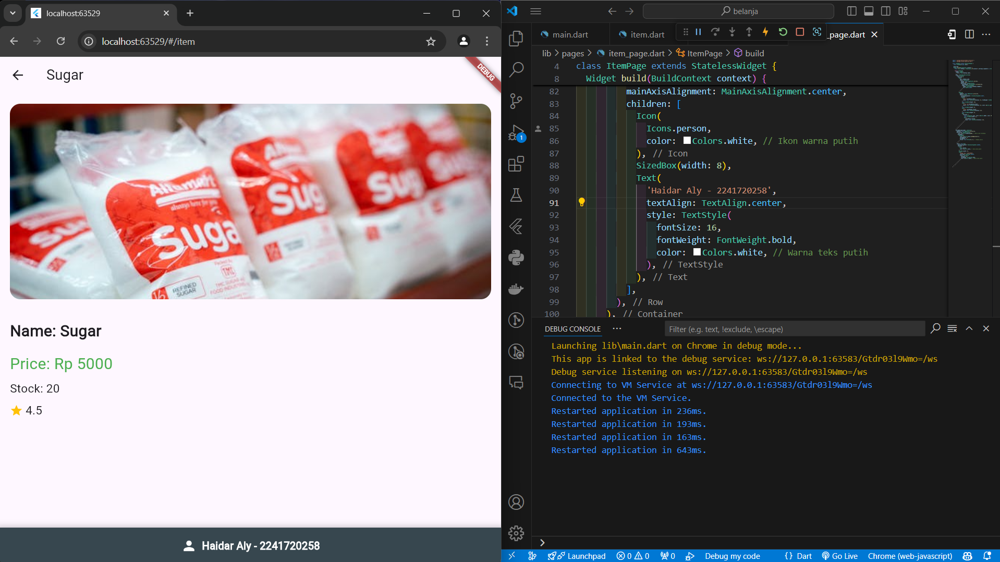